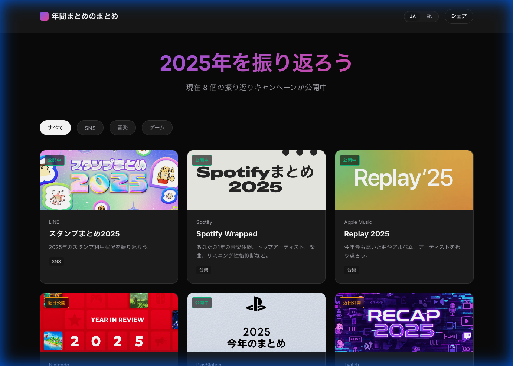
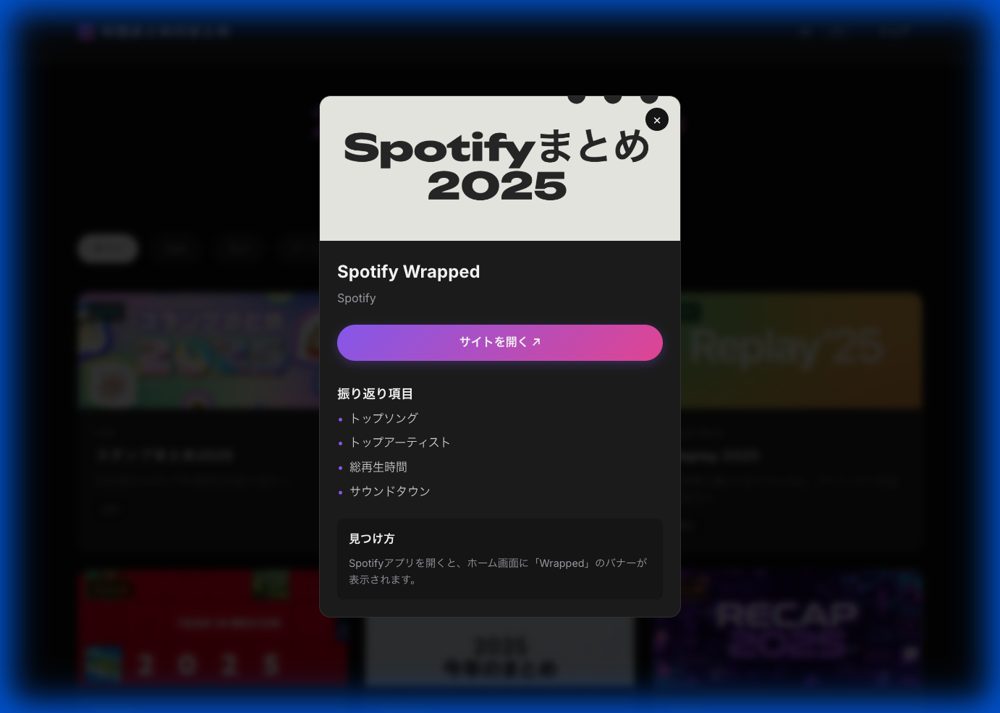
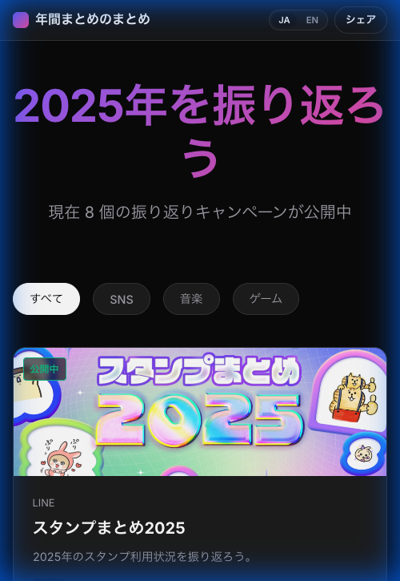

# 年間まとめのまとめ (Recap Hub 2025)

2025年の振り返りキャンペーン（Recap / Wrapped）をまとめてチェックできるポータルサイトです。Spotify, Apple Music, YouTube, Nintendo, PlayStationなど、様々なサービスの「あなたの1年」に簡単にアクセスできます。

[**プロジェクトを見る 🚀**](https://juuunnnk.github.io/Recap-hub/)

---

## ✨ 特徴 (Features)

- 📌 **オールインワン**: 主要な音楽、ゲーム、SNSなどの振り返りキャンペーンを網羅。
- 📱 **レスポンシブデザイン**: PCでもスマホでも見やすい、モダンでプレミアムなダークモードUI。
- 🌐 **多言語対応**: 日本語と英語を瞬時に切り替え可能。
- 🔗 **ダイレクトリンク**: 各サービスの振り返りページへ直接アクセス。

---

## 📸 スクリーンショット (Screenshots)

### 🖥 デスクトップ表示 (Desktop View)
モダンなカードレイアウトで、今公開されているキャンペーンを一目で確認できます。


### 💬 詳細モーダル (Detail Modal)
各キャンペーンの「見つけ方」や「振り返り項目」を詳しく解説しています。


### 📱 モバイル対応 (Mobile Optimization)
外出先でも、スマホからすぐに自分のレコメンドをチェックできます。


---

## 🛠 技術スタック (Tech Stack)

- **Frontend**: React + Vite
- **Styling**: Vanilla CSS (Custom Variable System)
- **Deployment**: GitHub Pages (Automated via GitHub Actions)
- **Data**: CSV-based service management

---

## 🚀 使い方 (Getting Started)

### ローカル開発 (Local Development)

```bash
# クローン
git clone https://github.com/juuunnnk/Recap-hub.git

# 依存関係のインストール
npm install

# 開発サーバー起動
npm run dev
```

---

## 📄 ライセンス (License)

このプロジェクトは非公式のファンプロジェクトです。掲載されている各サービスとは提携していません。

---

*Made with ❤️ for the community.*
